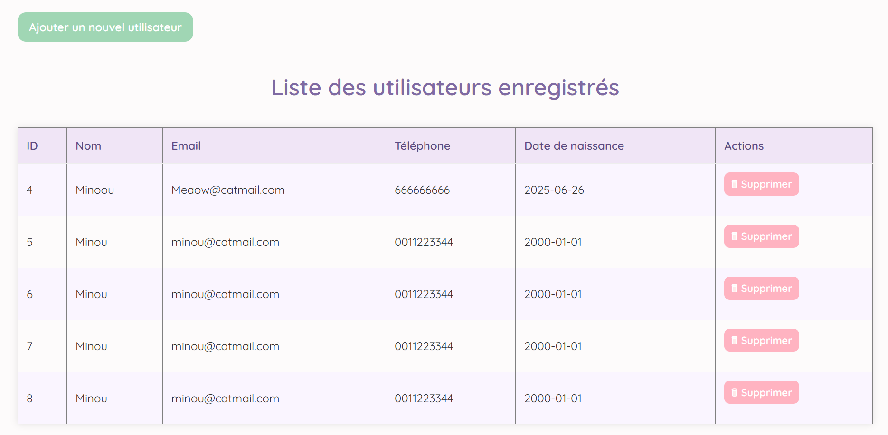

# 📚 UserManagement

Une mini-application web Java permettant d’ajouter, lister et supprimer des utilisateurs avec stockage en base SQLite.  
Le projet suit une architecture MVC claire, est stylisé en CSS pastel, et utilise Maven pour la compilation et les dépendances.

---

## 🛠️ Technologies

- Java 17+
- Servlet API (Jakarta)
- JSP
- SQLite (via JDBC)
- Maven (packaging `.war`)
- Tomcat 9+
- JUnit 4 (tests unitaires)

---

## 🚀 Lancer le projet

### 1. Compiler le projet avec Maven :
```bash
mvn clean package
```

### 2. Déployer dans Tomcat :
- Copier le fichier `target/usermanagement.war` dans `webapps/`
- Démarrer Tomcat :
```bash
bin/startup.bat
```

### 3. Accès :
- `index.jsp` : http://localhost:8080/usermanagement/
- `listUsers.jsp` : http://localhost:8080/usermanagement/users

---

## 🧪 Tests unitaires

Tests présents dans `src/test/java/com/example/usermanagement/dao/UserDAOTest.java` :

- ✅ Ajouter un utilisateur
- ✅ Lire tous les utilisateurs
- ✅ Supprimer un utilisateur

### Lancer les tests :
```bash
mvn test
```
---

## Capture d'écran 




## ✍️ Auteure

Imane Barbeche – Simplon CDA 2025
# AppWebJava
